[TOC](文章目录) 

- `[TOC](文章目录) `可以生成文件目录


- > 写Mrakdown费事？Typora让你像写Word一样行云流水，所见即所得。


<a name="Menutop" >顶部</a>

# [目录](#目录)

- [简介](#简介)
- [Markdown介绍](#Markdown介绍)

- [常用快捷键](#常用快捷键)

- [块元素](#块元素)

  -  [换行符](#换行符)

  - [标题级别](#标题级别)

  - [引用文字](#引用文字)

  - [无序列表](#无序列表)

  - [有序列表](#有序列表)

  - [任务列表](#任务列表)

  - [代码块](#代码块)

  - [数学表达式](#数学表达式)

  - [插入表格](#插入表格)

  - [脚注](#脚注)

    

- [Mermaid](#Mermaid)
- [数学公式](#数学公式)
- [锚点](#锚点)


#  [Typora入门：全网最全教程](https://www.cnblogs.com/hider/p/11614688.html)

## <a name="简介" >简介</a>

  Typora是一款轻便简洁的Markdown编辑器，支持即时渲染技术，这也是与其他Markdown编辑器最显著的区别。即时渲染使得你写Markdown就想是写Word文档一样流畅自如，不像其他编辑器的有编辑栏和显示栏。

  - Typora删除了预览窗口，以及所有其他不必要的干扰。取而代之的是实时预览。
  - Markdown的语法因不同的解析器或编辑器而异，Typora使用的是[GitHub Flavored Markdown](https://help.github.com/articles/basic-writing-and-formatting-syntax/)。

## <a name="Markdown介绍" >Markdown介绍</a>

  Markdown 是一种轻量级标记语言，它允许人们使用易读易写的纯文本格式编写文档。

  Markdown 语言在 2004 由约翰·格鲁伯（英语：John Gruber）创建。

  Markdown 编写的文档可以导出 HTML 、Word、图像、PDF、Epub 等多种格式的文档。

  Markdown 编写的文档后缀为 `.md`, `.markdown`。

## <a name="常用快捷键" >常用快捷键</a>

****
  - **加粗**： `Ctrl + B`
  - *字体倾斜* Ctrl+I  
  - <u>下划线</u> Ctrl+U  
  - ~~删除线~~ Alt+Shift+5
  -  打开大纲视图 `Ctrl + Shift + 1`
  - 标题： `Ctrl + H`
  - 插入链接： `Ctrl + K`
  - 插入代码： `Ctrl + Shift + C` -- 无法执行
  - 行内代码： `Ctrl + Shift + K`
  - 插入图片： `Ctrl + Shift + I`
  - 无序列表：`Ctrl + Shift + L` -- 无法执行
  - 撤销： `Ctrl + Z`
  - 一级标题： `Ctrl + 1` -- 以此类推

  ~~~c
  Typora快捷键整合
  
  Ctrl+1  一阶标题    Ctrl+B  字体加粗
  Ctrl+2  二阶标题    Ctrl+I  字体倾斜
  Ctrl+3  三阶标题    Ctrl+U  下划线
  Ctrl+4  四阶标题    Ctrl+Home   返回Typora顶部
  Ctrl+5  五阶标题    Ctrl+End    返回Typora底部
  Ctrl+6  六阶标题    Ctrl+T  创建表格
  Ctrl+L  选中某句话   Ctrl+K  创建超链接
  Ctrl+D  选中某个单词  Ctrl+F  搜索
  Ctrl+E  选中相同格式的文字   Ctrl+H  搜索并替换
  Alt+Shift+5 删除线 Ctrl+Shift+I    插入图片
  Ctrl+Shift+M    公式块 Ctrl+Shift+Q    引用
  
  注：一些实体符号需要在实体符号之前加”\”才能够显示
  
  ~~~

## <a name="块元素" >块元素</a>

### <a name="换行符" >换行符</a>

  在markdown中，段落由多个空格分隔。在Typora中，只需回车即可创建新段落。

### <a name="标题级别" >标题级别</a>

  \# 一级标题 快捷键为 Ctrl + 1
  \## 二级标题 快捷键为 Ctrl + 2
  ......
  \###### 六级标题 快捷键为 Ctrl + 6

### <a name="引用文字" >引用文字</a>

  \> + 空格 + 引用文字

### <a name="无序列表" >无序列表</a>

  使用 * + - 都可以创建一个无序列表

  * AAA
  - BBB
  + CCC

    

    

    

    

    

### <a name="区块嵌套" >区块嵌套</a>

- 通过">"个数展示分层差别

> markdown

> > 基础

> > > 区块引用


- 区块中使用列表

> 区块中使用列表

> 1.第一项
>
> 2.第二项
>
> > + 第一项
> > + 第二项
> > + 第三项

### <a name="有序列表" >有序列表</a>

  使用 1. 2. 3. 创建有序列表

  1. AAA
  2. BBB
  3. CCC

### <a name="任务列表" >任务列表</a>

  \ -[ ] 不勾选
  \ -[x] 勾选

### <a name="代码块" >代码块</a>

  在Typora中插入程序代码的方式有两种：使用反引号 `（~ 键）、使用缩进（Tab）。

  - 插入行内代码，即插入一个单词或者一句代码的情况，使用 `code` 这样的形式插入。

  - 插入多行代码输入3个反引号（`） + 回车，并在后面选择一个语言名称即可实现语法高亮。

    ~~~python
    def helloworld():
        print("hello, world!")
    ~~~

### <a name="数学表达式" >数学表达式</a>

  当你需要在编辑器中插入数学公式时，可以使用两个美元符 $$ 包裹 TeX 或 LaTeX 格式的数学公式来实现。根据需要加载 Mathjax 对数学公式进行渲染。

  按下 `$$`，然后按下回车键，即可进行数学公式的编辑。

  ```powershell
  $$
  \mathbf{V}_1\times\mathbf{V}_2 = \mathbf{X}_3
  $$
  ```

### <a name="插入表格" >插入表格</a>

  输入 `| 表头1 | 表头2 |`并回车。即可创建一个包含2列表。快捷键 `Ctrl + T`弹出对话框。

  |  id  | number |
  | :--: | :----: |
  |      |        |

|  表头  | 表头 | 表头 |      |      |      |
| :----: | ---- | ---- | ---- | ---- | ---- |
| 单元格 | 1    | 2    |      |      |      |
| 单元格 | 1    | 2    |      |      |      |


  - 不管是哪种方式，第一行为表头，第二行为分割表头和主体部分，第三行开始每一行为一个表格行
  - 列与列之间用管道符号` |` 隔开
  - 还可设置对齐方式(表头与内容之间)，如果不使用对齐标记，内容默认左对齐，表头居中对齐
    - 左对齐 ：|
    - 右对齐 |：
    - 中对齐 ：|：
  - 为了美观，可以使用空格对齐不同行的单元格，并在左右两侧都使用 | 来标记单元格边界
  - 为了使 Markdown 更清晰，| 和 - 两侧需要至少有一个空格（最左侧和最右侧的 | 外就不需要了）。

### <a name="脚注" >脚注</a>

  这个例子的脚注为[[1\]](https://www.cnblogs.com/hider/p/11614688.html#fn1)。

  注意：该例子脚注标识是1，脚注标识可以为字母数字下划线，但是暂不支持中文。脚注内容可为任意字符，包括中文。

### <a name="分割线" >分割线</a>

  输入 `***` 或者 `---` 再按回车即可绘制一条水平线，如下：

------

### <a name="目录（TOC）" >目录</a>

  输入 `[ toc ]` 然后回车，即可创建一个“目录”。TOC从文档中提取所有标题，其内容将自动更新。

  > Typora支持TOC自动生成目录，博客园不支持？

  

  目录

  - [简介](https://www.cnblogs.com/hider/p/11614688.html#简介) 
  - [Markdown介绍](https://www.cnblogs.com/hider/p/11614688.html#markdown介绍)
  - [常用快捷键](https://www.cnblogs.com/hider/p/11614688.html#常用快捷键)
  - 块元素
    - [换行符](https://www.cnblogs.com/hider/p/11614688.html#换行符)
    - [标题级别](https://www.cnblogs.com/hider/p/11614688.html#标题级别)
    - [引用文字](https://www.cnblogs.com/hider/p/11614688.html#引用文字)
    - [无序列表](https://www.cnblogs.com/hider/p/11614688.html#无序列表)
    - [有序列表](https://www.cnblogs.com/hider/p/11614688.html#有序列表)
    - [任务列表](https://www.cnblogs.com/hider/p/11614688.html#任务列表)
    - [代码块](https://www.cnblogs.com/hider/p/11614688.html#代码块)
    - [数学表达式](https://www.cnblogs.com/hider/p/11614688.html#数学表达式)
    - [插入表格](https://www.cnblogs.com/hider/p/11614688.html#插入表格)
    - [脚注](https://www.cnblogs.com/hider/p/11614688.html#脚注)
    - [分割线](https://www.cnblogs.com/hider/p/11614688.html#分割线)
    - [目录（TOC）](https://www.cnblogs.com/hider/p/11614688.html#目录toc)
  - 跨度元素
    - 链接
      - [内部链接](https://www.cnblogs.com/hider/p/11614688.html#内部链接)
      - [参考链接](https://www.cnblogs.com/hider/p/11614688.html#参考链接)
    - [网址](https://www.cnblogs.com/hider/p/11614688.html#网址)
    - [图片](https://www.cnblogs.com/hider/p/11614688.html#图片)
    - [斜体](https://www.cnblogs.com/hider/p/11614688.html#斜体)
    - [加粗](https://www.cnblogs.com/hider/p/11614688.html#加粗)
    - [加粗斜体](https://www.cnblogs.com/hider/p/11614688.html#加粗斜体)
    - [代码标记](https://www.cnblogs.com/hider/p/11614688.html#代码标记)
    - [删除线](https://www.cnblogs.com/hider/p/11614688.html#删除线)
    - [下划线](https://www.cnblogs.com/hider/p/11614688.html#下划线)
    - [表情符号](https://www.cnblogs.com/hider/p/11614688.html#表情符号)
    - [下标](https://www.cnblogs.com/hider/p/11614688.html#下标)
    - [上标](https://www.cnblogs.com/hider/p/11614688.html#上标)
    - [高亮](https://www.cnblogs.com/hider/p/11614688.html#高亮)
    - [文本居中](https://www.cnblogs.com/hider/p/11614688.html#文本居中)
    - [换行符](https://www.cnblogs.com/hider/p/11614688.html#换行符-1)
    - [转义](https://www.cnblogs.com/hider/p/11614688.html#转义)
  - HTML
    - [嵌入内容](https://www.cnblogs.com/hider/p/11614688.html#嵌入内容)
    - [视频](https://www.cnblogs.com/hider/p/11614688.html#视频)
  - [总结](https://www.cnblogs.com/hider/p/11614688.html#总结)

  

## <a name="跨度元素" >跨度元素</a>

  跨度元素即图片，网址，视频等，在Typora中输入后，会立即载入并呈现。

### <a name="链接" >链接</a>

#### <a name="内部链接" >内部链接</a>

  这是一个带有标题属性的 `[链接](http://example.com/ "标题")`
  这是一个没有标题属性的 `[链接](http://example.net/)`

  [链接](http://example.com/)

  [链接](http://example.net/)

- 可以在括号里面加上注释，`[]`里面写链接文字，`()`写链接地址，`()`中的引号内容为title属性，可加可不加。title属性的效果为鼠标悬停在链接上会出现title文字。`[链接文字](链接地址 "链接标题")`这样的形式。链接地址与链接标题前有一个空格。

欢迎来到[居居之家](https://www.nikangechuizi.com   "居居之家")

#### <a name="参考链接" >参考链接</a>

  这是一个[参考链接]id -- 无法执行

### <a name="网址" >网址</a>

  Typora允许用<括号括起来>, 把URL作为链接插入。

  Typora还会自动链接标准网址。

  www.baidu.com

### <a name="图片" >图片</a>

  ```
  
  
  ```

  除了以上2种方式之外，还可以直接将图片拖拽进来，自动生成链接。

### <a name="斜体" >斜体</a>

  使用 `*单个星号*` 或者 `_单下划线_` 可以字体倾斜。快捷键 `Ctrl + I`

  *斜体*

_单下划线_

### <a name="加粗" >加粗</a>

  使用 `**两个星号**` 或者 `__两个下划线__` 可以字体加粗。快捷键 `Ctrl + B`

  **加粗**

### <a name="加粗斜体" >加粗斜体</a>

  使用`***加粗斜体***`可以加粗斜体。

  ***加粗斜体***

### <a name="代码标记" >代码标记</a>

  标记代码使用反引号，即在英文输入法下，ESC键下面和1键左边的符号。

  > 使用该 `printf()`功能

### <a name="删除线" >删除线</a>

  使用`~~删除线~~` 快捷键 `Alt + Shift + 5`

  ~~删除线~~

### <a name="下划线" >下划线</a>

  \下划线 -- 无法执行

  参考另一篇文章，可执行。

  通过`<u>下划线的内容</u>` 或者 快捷键`Ctrl + U`可实现下划线

  下划线的内容

### <a name="表情符号" >表情符号</a>

  Github的Markdown语法支持添加emoji表情，输入不同的符号码（两个冒号包围的字符）可以显示出不同的表情。

  :smile -- 无法显示

  😺

### <a name="下标" >下标</a>

  可以使用 `<sub>文本</sub>`实现下标。

  (需在设置中打开该功能)

  H2O

  H2O

### <a name="上标" >上标</a>

  可以使用`<sup>文本</sup>`实现上标。

  (需在设置中打开该功能)

  X2

  X2

### <a name="高亮" >高亮</a>

  `==高亮==`(需在设置中打开该功能)

  ==我是最重要的==

### <a name="文本居中" >文本居中</a>

  使用 `<center>这是要居中的内容</center>`可以使文本居中

  <center>这是要居中的文本内容 

### <a name="换行符" >换行符</a>

  使用 `空格 + 空格 + Enter`可以实现换行，例如：

  或者可以使用`<br/>`实现换行。

  

  

### <a name="转义" >转义</a>

  Markdown 使用了很多特殊符号来表示特定的意义，如果需要显示特定的符号则需要使用转义字符，Markdown 使用反斜杠转义特殊字符：

  **文本加粗**
  ** 正常显示星号 **

 \*\*正常\*\*

  Markdown 支持以下这些符号前面加上反斜杠来帮助插入普通的符号：

  ```markdown
  \   反斜线
  `   反引号
  *   星号
  _   下划线
  {}  花括号
  []  方括号
  ()  小括号
  #   井字号
  +   加号
  -   减号
  .   英文句点
  !   感叹号
  ```

## <a name="HTML" >HTML</a>

  支持HTML

  不在 Markdown 涵盖范围之内的标签，都可以直接在文档里面用 HTML 撰写。

  目前支持的 HTML 元素有：`<kbd> <b> <i> <em> <sup> <sub> <br>`等 ，如：

  ```css
  使用 <kbd>Ctrl</kbd>+<kbd>Alt</kbd>+<kbd>Del</kbd> 重启电脑
  <kbd> </kbd> -- 白色框框
  ```

## <a name="总结" >总结</a>

  1. 建议打开大纲视图`Ctrl + Shift + 1`
  2. 插入表格需要顶格写，否则无法显示
  3. 语法无须刻意记忆，右键可查询

  > 参考链接1：[Typora入门（中文版）](https://www.simon96.online/2018/10/18/Typora入门（中文版）/)
  >
  > 参考链接2：[Typora](https://www.jianshu.com/p/b7fd16a44508)
  >
  > 参考链接3：[Markdown代码块与语法高亮](https://www.jianshu.com/p/65ab196bef04)
  >
  > 参考链接4：[Markdown使用-表格及其居中等格式](https://www.cnblogs.com/anliux/p/10805103.html)
  >
  > 参考链接5：[Markdown语法小结](https://www.cnblogs.com/rossoneri/p/4446440.html)
  >
  > 参考链接6：[Runoob：Markdown教程](https://www.runoob.com/markdown/md-tutorial.html)

------

  1. 这是脚注的实际内容。 [↩︎](https://www.cnblogs.com/hider/p/11614688.html#fnref1)


## <a name="Mermaid" >Mermaid</a>

### 概述

* 什么是Mermaid？
  * Mermaid是一种基于Javascript的绘图工具，使用类似于Markdown的语法，使用户可以方便快捷地通过代码创建图表。
  * 项目地址：https://github.com/mermaid-js/mermaid（需要将梯子设置成全局模式才能访问）

- 怎么使用Mermaid？

  - 使用特定的Mermaid渲染器；
  - **使用集成了Mermaid渲染功能的Markdown编辑器，如[Typora](https://www.typora.io/)。**使用时，需要将代码块的语言选择为Mermaid。

  > Typora是宇宙第一笔记软件，不接受反驳

- Mermaid能绘制哪些图？

  - 饼状图：使用`pie`关键字，具体用法后文将详细介绍
  - 流程图：使用`graph`关键字，具体用法后文将详细介绍
  - 序列图：使用`sequenceDiagram`关键字
  - 甘特图：使用`gantt`关键字
  - 类图：使用`classDiagram`关键字
  - 状态图：使用`stateDiagram`关键字
  - 用户旅程图：使用`journey`关键字

- 实例：朱元璋家谱简图，圆圈代表皇帝

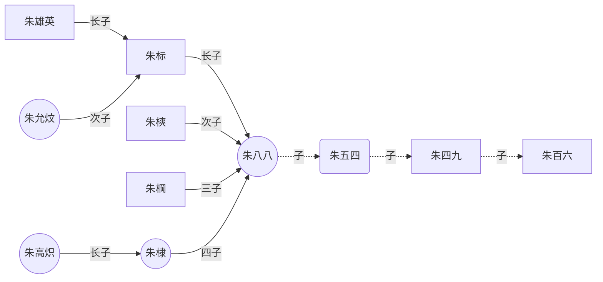

以上是概述，下面详细介绍饼状图和流程图的语法。其他图的语法可访问上文给出的项目地址，自行学习。（记得挂梯子）

### 饼状图

- 在线渲染器：[Online FlowChart & Diagrams Editor](https://mermaidjs.github.io/mermaid-live-editor/#/edit/eyJjb2RlIjoicGllXG5cIkRvZ3NcIiA6IDQyLjk2XG5cIkNhdHNcIiA6IDUwLjA1XG5cIlJhdHNcIiA6IDEwLjAxIiwibWVybWFpZCI6eyJ0aGVtZSI6ImRlZmF1bHQifX0)（需要梯子）

- 语法
  - 从`pie`关键字开始图表
  - 然后使用`title`关键字及其在字符串中的值，为饼图赋予标题。（这是**可选的**）
  - 数据部分
    - 在`" "`内写上分区名。
    - 分区名后使用`:`作为分隔符
    - 分隔符后写上数值，最多支持2位小数——数据会以百分比的形式展示

* 实例

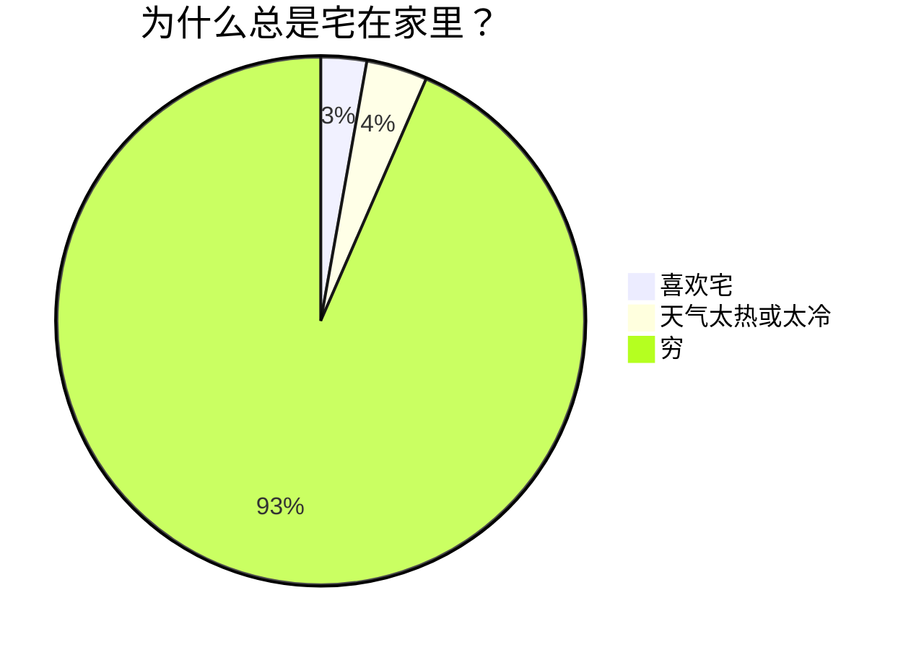

### Mermaid流程图

- 在线渲染器：[Online FlowChart & Diagrams Editor](https://mermaidjs.github.io/mermaid-live-editor/#/edit/eyJjb2RlIjoiZ3JhcGggVERcbiAgICBBW0hhcmRdIC0tPnxUZXh0fCBCKFJvdW5kKVxuICAgIEIgLS0-IEN7RGVjaXNpb259XG4gICAgQyAtLT58T25lfCBEW1Jlc3VsdCAxXVxuICAgIEMgLS0-fFR3b3wgRVtSZXN1bHQgMl0iLCJtZXJtYWlkIjp7InRoZW1lIjoiZGVmYXVsdCJ9fQ)（需要挂梯子）

#### 实例

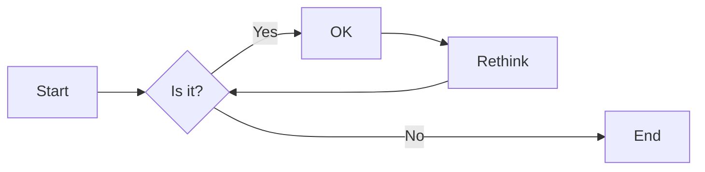

#### 方向

用于开头，声明流程图的方向。

* `graph`或`graph TB`或`graph TD`：从上往下
* `graph BT`：从下往上
* `graph LR`：从左往右
* `graph RL`：从右往左

#### 结点

* 无名字的结点：直接写内容，此时结点边框为方形；节点内容不能有空格
* 有名字的结点：节点名后书写内容，内容左右有特定符号，结点边框由符号决定；节点内容可以有空格

> 下面的实例中，没有为graph指定方向，因此默认是从上往下的。但是由于各个结点之前没有箭头，所以他们都处于同一排。


#### 连线样式

* 实线箭头：分为无文本箭头和有文本箭头，有文本箭头有2种书写格式

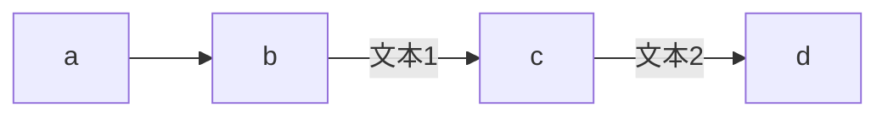

* 粗实线箭头：分为无文本箭头和有文本箭头

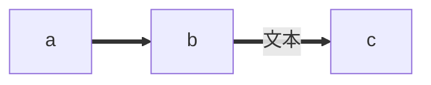

* 虚线箭头：分为无文本箭头和有文本箭头

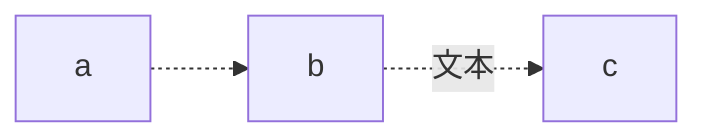

* 无箭头线：即以上三种连线去掉箭头后的形式

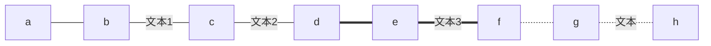

* 其他连线：需要将`graph`关键字改为`flowchart`，除了新增加的连线形式外，上面三种线的渲染效果也会不同

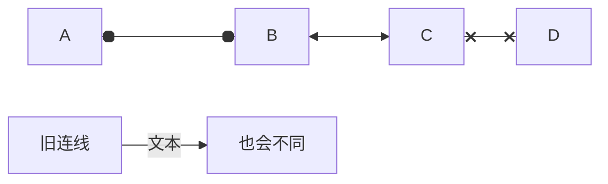

* 延长连线：增加相应字符即可，如下图中的B到E，连线中增加了一个`-`。字符可多次添加。

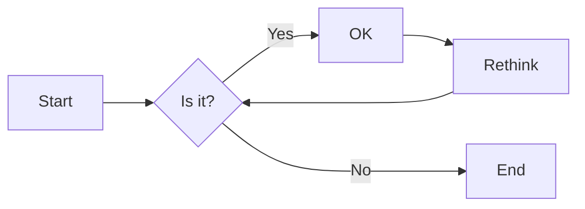


#### 连线形式

* 直链

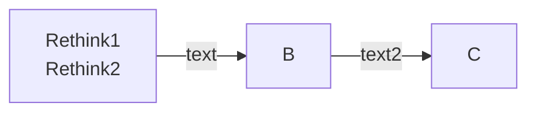

* 多重链：可以使用`&`字符，或单个描述

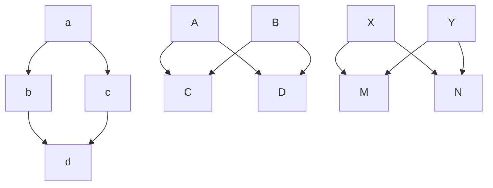

#### 其他

* 子图：需要将`graph`关键字改为`flowchart`，在代码段的开始加入`subgraph`，尾部加入`end`

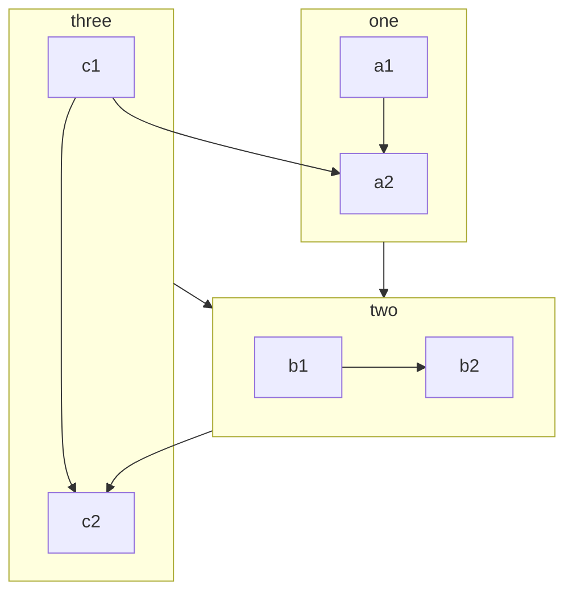

- 注释：在行首加入`%%`即可。

- 特殊字符用其ASCII代替，比如%用&#37代替，或者直接用"%"双引号引用起来

  ~~~mermaid
  graph 
      设备湿度 --2s--> 75&#37RH -- shi--> BU & 否 
      E("%")-->D["()"]
      G("E")-->F
     A[TESTA]-->B
     C((TESTC))-->B
  ~~~

  

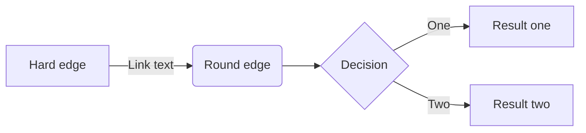


~~~mermaid
pie
    title 居居是猪吗？
    "是" : 15
    "可能是" : 20
    "应该是吧" : 50
    "不太清楚" : 20
~~~


## <a name="数学公式" >数学公式</a>

### 公式块

$$
h_\theta(x) = \theta_0 + \theta_1x
$$

### 行内公式

在$$的中间加入需要的公式

- 方法一：先按$，再按esc
- 

这个$\theta$是个theta


$x^2$

$y_1$

$\infty$

$-\infty$

$a+b-c*d$

$a\div{b}$

$a\pm{b}$

$\frac{a}{b}$

$$\sqrt{b}$$

$\cdots$

$\sin{\theta}$

$cos{\theta}$

$tan{\theta}$

$cot{\theta}$

$\vec{F}$

$\sum_{i=1}^{n}{a_i}$

$\prod_{i=1}^{n}{a_i}$

$\lim_{a\rightarrow+\infty}{a+b}$

$\alpha$

$\beta$

$\gamma$

$\delta$

$\epsilon$

$\varepsilon$

$\eta$

$\theta$

$\kappa$

$\iota$

$\zeta$

$\lambda$

$\mu$

$\phi$

$\pi$

$\rho$

$\xi$

$\nu$

$\upsilon$

$\varphi$

$\chi$

$\psi$

$\omega$

$\leq$

$\geq$

### <a name="矩阵" >**矩阵**</a>

#### 简单矩阵

使用\begin{matrix}…\end{matrix}生成， 每一行以\\结尾表示换行，元素间以&间隔，式子的表示序号\tag{1}（右边的序号）。
$$
\begin{matrix}
1 & 2 & 3 & \\
4 & 5 & 6 & \\
7 & 8 & 9  \\
\end{matrix} \tag{666}
$$

#### 带左右括号的矩阵(大中小括号)

方法一：在\begin{}之前和\end{}之后添加左右括号的代码。
$$
\left\{ 
 \begin {matrix}
 1 & 2 & 3 & \\
 4 & 5 & 6 & \\
 7 & 8 & 9  
\end {matrix}
\right \} \tag{888}
$$

- 中括号

$$
\left[ 
 \begin {matrix}
 1 & 2 & 3 & \\
 4 & 5 & 6 & \\
 7 & 8 & 9  
\end {matrix}
\right] \tag{888}
$$

- 小括号

$$
\left( 
 \begin {matrix}
 1 & 2 & 3 & \\
 4 & 5 & 6 & \\
 7 & 8 & 9  
\end {matrix}
\right) \tag{888}
$$

方法二：改变`\begin{matrix}` 和`\end{matrix}`中的`{matrix}`

- 大括号

$$
\begin {Bmatrix}
 1 & 2 & 3 & \\
 4 & 5 & 6 & \\
 7 & 8 & 9  
\end {Bmatrix}
 \tag{888}
$$

- 中括号

$$
\begin {bmatrix}
 1 & 2 & 3 & \\
 4 & 5 & 6 & \\
 7 & 8 & 9  
\end {bmatrix}
 \tag{888}
$$


#### 包含希腊字母与省略号

- 行省略号`\cdots`，列省略号`\vdots`，斜向省略号（左上至右下）`\ddots`

$$
\left\{ 
 \begin {matrix}
 1 & 2 & \cdots & 5 \\
 4 & 5 & \cdots & \\
 \vdots & \vdots & \ddots & \vdots  \\
  \alpha & \alpha+1 & \cdots & \alpha+4
\end {matrix}
\right \} \tag{888}
$$

## <a name="行列式" >行列式</a>

- 行列式相关语法与矩阵类似

$$
\begin {vmatrix}
 1 & 2 & 3 & \\
 4 & 5 & 6 & \\
 7 & 8 & 9  
\end {vmatrix}
 \tag{888}
$$

### 表格


#### 简易表格

$$
\begin {array}{|c|c|c|}
\hline 1&2&3\\
\hline 4&5&6\\
\hline 7&8&9\\
\hline
\end {array}
 \tag{888}
$$

- 其中`{|c|c|c|}` ,`c`,`l`,`r`分别代表居中、左对齐及右对齐

- 分割线在定义式中插入`|`，两条用`||`
- 水平分割线：在下一行输入前插入`\hline`，以下图真值表为例
- 其他：每行元素间均需要插入`&`,每行元素以`\\`结尾

### 真值表

$$
\begin{array}{cc|c}
	       A&B&F\\
	\hline 0&0&0\\
	       0&1&1\\
	       1&0&1\\
	       1&1&1\\
\end{array}
$$

### 多等式对齐

$$
\begin{aligned}
a &= b + c \\
  &= d + e + f
\end{aligned}
$$

### 方程组、条件表达式

$$
\begin{cases}
3x + 5y +  z \\
7x - 2y + 4z \\
-6x + 3y + 2z
\end{cases}
$$

$$
f(n) =
\begin{cases} 
n/2,  & \text{if }n\text{ is even} \\
3n+1, & \text{if }n\text{ is odd}
\end{cases}
$$

### 间隔 (大小空格、紧贴)
紧贴 + 无空格 + 小空格 + 中空格 + 大空格 + 真空格 + 双真空格
$$
a\!b + ab + a\,b + a\;b + a\ b + a\quad b + a\qquad b
$$
紧贴\!

无空格 小空格\, 中空格\; 大空格\

真空格\quad 双真空格\qquad


## <a name="锚点" >锚点</a>

 [回到顶部](#Menutop)

[简介](#简介)


如果还有任何疑问，请点击[这里](https://baidu.com),任何问题都能解决！


